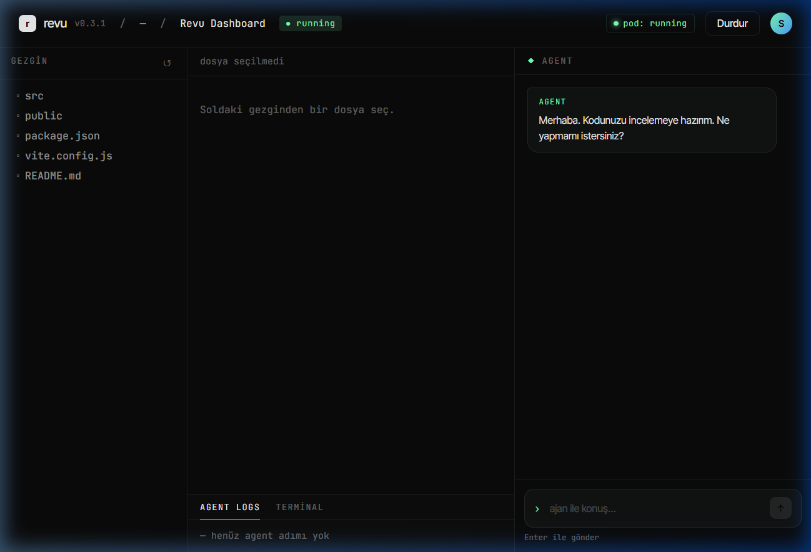
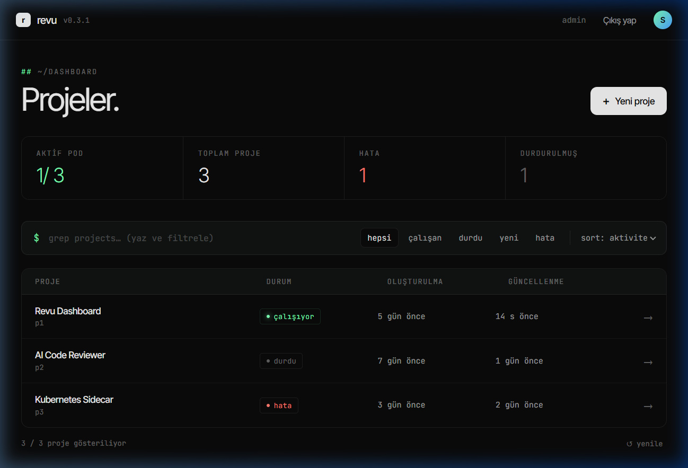
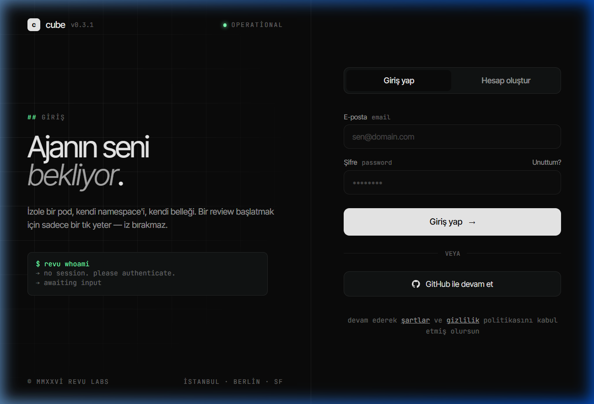

# 🧊 Cube — AI Destekli Bulut Geliştirme Platformu

Cube, kullanıcıların doğrudan tarayıcı üzerinden yapay zeka (AI) destekli kod yazabildiği, düzenleyebildiği ve anlık olarak önizleyebildiği bulut tabanlı bir geliştirme platformudur. Projeler Kubernetes üzerinde izole bir şekilde çalışır ve LangGraph tabanlı bir AI ajanı kod yazımına doğrudan eşlik eder.

## 🚀 Öne Çıkan Özellikler

- **AI Ajanı ile Geliştirme:** LangGraph ve Google Gemini 1.5 Pro tabanlı ajan ile doğal dilde kod yazdırın ve hataları ayıklayın. RAG (Qdrant) desteği sayesinde ajan tüm projenin bağlamına hakimdir.
- **İzole Çalışma Ortamları (Sandbox):** Her proje için ayrı bir Kubernetes namespace ve pod tahsis edilir. Kapsamlı path traversal ve komut filtreleme korumalarına sahip Sidecar mimarisi ile güvenli komut çalıştırma.
- **Gerçek Zamanlı İletişim:** WebSocket üzerinden ajan adımlarını ve konsol loglarını anlık izleme imkanı.
- **Gelişmiş Güvenlik:** JWT ve Refresh Token Rotation ile güvenli oturum yönetimi. İki katmanlı (Nginx & SlowAPI) rate limiting koruması.
- **Maliyet Optimizasyonu:** Idle (boşta kalan) pod'ları otomatik tespit edip durduran arka plan servisleri ile gereksiz kaynak tüketiminin önüne geçilir.
- **GitHub Entegrasyonu:** Public GitHub repolarını çalışma alanına saniyeler içinde dahil etme desteği.

## 📸 Ekran Görüntüleri

### 1. Çalışma Alanı (Workspace) ve AI Ajan

*Modern, üç bölmeli IDE arayüzü: Dosya Gezgini, Kod Görüntüleyici ve AI Chat & Terminal*

### 2. Proje Yönetimi (Dashboard)

*Projelerin durumunu anlık izleyebileceğiniz merkezi kontrol paneli*

### 3. Kullanıcı Girişi

*Güvenli oturum açma ve kayıt arayüzü*

## 🛠 Teknoloji Yığını

- **Frontend:** React 19.1, Vite, React Router DOM, Özel CSS (CSS variables tabanlı)
- **Backend:** Python 3.12, FastAPI, Uvicorn, LangGraph, LangChain, Pydantic v2
- **Veritabanı:** MongoDB Atlas (Motor async driver)
- **Vektör Veritabanı:** Qdrant (RAG işlemleri için)
- **Yapay Zeka:** Google Gemini 1.5 Pro & gemini-embedding-2
- **Altyapı:** Kubernetes (Minikube), Docker, Docker Compose, Nginx

## ⚙️ Kurulum ve Dağıtım

Platformu ayağa kaldırmak için öncelikle ortam değişkenlerini (`.env`) yapılandırmanız gerekir. Gerekli tüm parametreler için `.env.example` dosyasını baz alabilirsiniz.
Başlıca gerekli değişkenler: `MONGODB_URI`, `JWT_SECRET_KEY`, `GOOGLE_API_KEY`.

### Yerel Geliştirme (Sadece Backend & MongoDB)
```bash
cd backend
pip install -r requirements.txt
cp .env.example .env
# .env dosyasını gerekli bilgilerle doldurun
uvicorn main:app --reload --host 0.0.0.0 --port 8000
```

### Minikube ile Tam Kurulum (Full Stack)
```powershell
minikube start
minikube addons enable ingress
minikube tunnel  # Ayrı bir terminal penceresinde açık kalmalı

# Sidecar Docker imajını Minikube ortamına build edin
powershell -ExecutionPolicy Bypass -File .\backend\scripts\build-sidecar-minikube.ps1

# Backend'i başlatın (Kubeconfig otomatik olarak entegre edilecektir)
powershell -ExecutionPolicy Bypass -File .\backend\scripts\start-backend-minikube.ps1
```

### Üretim Ortamı (Docker Compose)
```bash
cp .env.example .env
# .env dosyasını üretim parametreleriyle doldurun
docker-compose up -d
docker-compose logs -f backend
```

## 🏗 Mimari Detaylar

1. **Nginx Reverse Proxy:** HTTP trafiğini HTTPS'e yönlendirir, WebSocket (`Upgrade`) isteklerini yönetir ve IP bazlı aşımlar için Rate Limiting uygular.
2. **Kubernetes Pod Yapısı:** 
   - **App Container:** Boşta bekleyen (idle loop) ve kullanıcının uygulamasının barındırıldığı asıl ortamdır.
   - **Sidecar Container (FastAPI):** `/workspace` (emptyDir) volume'unu App Container ile paylaşır. AI ajanının dosya okuma/yazma ve izole komut çalıştırma (`/exec`) isteklerini güvenlik kuralları (Path traversal vb.) çerçevesinde yönetir.
3. **AI ve RAG İş Akışı:** Qdrant üzerinde tutulan proje dosyaları anlamsal olarak aranır (Semantic Search). En uygun kod parçaları Gemini promptuna Context olarak enjekte edilip ajana sunulur, böylelikle büyük projelerde dahi ajan yüksek doğrulukla çalışır.

## 🤝 Katkıda Bulunma

- Hatalar (bug) ve özellik istekleri (feature requests) için lütfen "Issues" kısmını kullanın.
- Büyük ve yapısal değişiklikler yapmadan önce sistemin mevcut işleyişini bozmamak adına tartışmak için bir "Issue" açmanız rica olunur.
